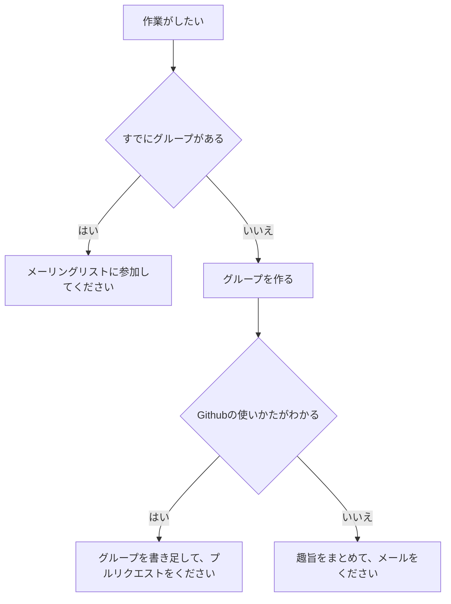

# Code for Chiyoda 🌸

東京都千代田区の、当事者の合意にもとづく技術提供に主軸を置く自助会です。

## 👋 方針

- 実用主義: 大まかな合意とすぐに動く実装が最重要です。いつか世界を変える政策よりも、いま危機にある自分らをただちに救う方法に興味があります。
- 文書化: その余裕があれば、文書を残します。いつか困難に直面する子どもたちが、迷ってしまわないように。

## 🎉 活動したい場合

[ASK-2T3C-9](https://github.com/code4chiyoda/ASK-2T3C/blob/main/9.md)を参考に、ワーキンググループを作ることができます。

作業をしたい人へ: 以下の道すじに沿ってください。

- 既存のワーキンググループに参加したい場合: メーリングリストに参加してください。
- ワーキンググループを作りたい場合:
  - 私はGithubの使い方を知っています: メーリングリストができたら、本READMEにワーキンググループを書き足して、プルリクエストをください。
  - 私はGithubを使ったことがありません: 趣旨をまとめて、`rsm4905dc[a]mozmail.com`（`[a]`を`@`に置き換えてください）までご連絡ください。

## 🍟 現在有効なワーキンググループ

千代田区営住宅自殺防止・危機介入に関するワーキンググループ

- 2025年11月5日に作成
- メーリングリストが存在しますが、プライバシー上の配慮により公開していません。
- メンバー:
  - A（居住者）
  - B（居住者）
  - 矢崎 愛（看護師 ソフィアメディ株式会社）

## 🗒️ 情報提供

[ASK文書](https://github.com/code4chiyoda/ASK-2T3C)をご覧ください。

---

任意団体 Code for Chiyoda

<!--

**Here are some ideas to get you started:**

🙋‍♀️ A short introduction - what is your organization all about?
🌈 Contribution guidelines - how can the community get involved?
👩‍💻 Useful resources - where can the community find your docs? Is there anything else the community should know?
🍿 Fun facts - what does your team eat for breakfast?
🧙 Remember, you can do mighty things with the power of [Markdown](https://docs.github.com/github/writing-on-github/getting-started-with-writing-and-formatting-on-github/basic-writing-and-formatting-syntax)
-->
