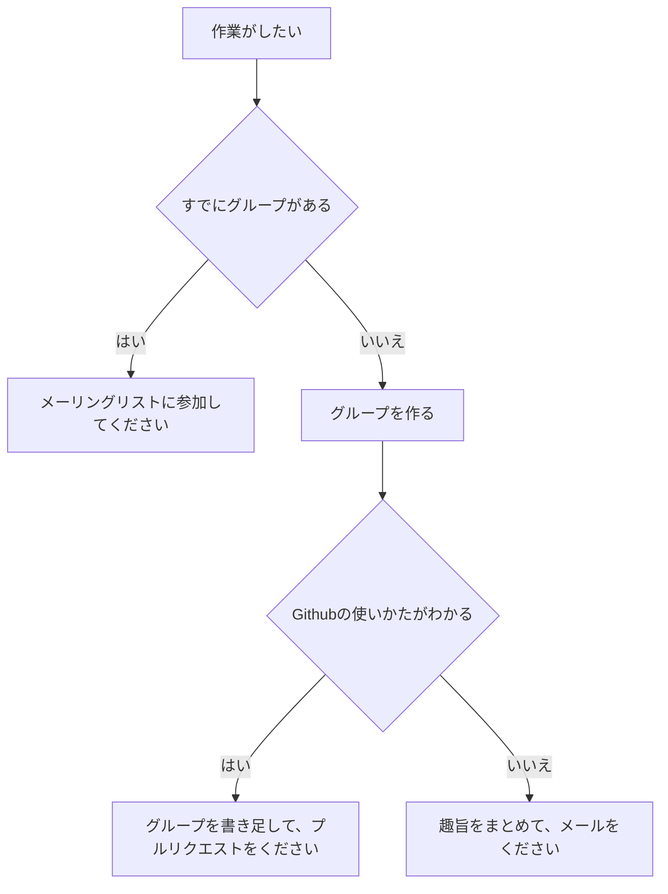

# Code for Chiyoda 🌸

東京都千代田区の、市民が共有資源を持ち寄り維持するための任意団体です。

こんなものを想定しています。

- 関連する調査資料
- 整理・検証されたデータセット
- ソフトウェアおよびソースコード
- 知識の交換と共有のための会合

## 🎉 活動したい場合

以下の道すじに沿ってください。

- 既存のワーキンググループに参加したい場合: メーリングリストに参加してください。
- ワーキンググループを作りたい場合:
  - 私はGithubの使い方を知っています: メーリングリストができたら、本READMEにワーキンググループを書き足して、プルリクエストをください。
  - 私はGithubを使ったことがありません: 趣旨をまとめて、`rsm4905dc[a]mozmail.com`（`[a]`を`@`に置き換えてください）までご連絡ください。

```mermaid
graph TD
c4c_join --> if_wg
if_wg -->|はい| wg_join
if_wg -->|いいえ| wg_create
wg_create --> if_github
if_github -->|はい| create_pr
if_github -->|いいえ| send_mail

c4c_join[作業がしたい]
if_wg{すでにグループがある}
wg_join[メーリングリストに参加してください]
wg_create[グループを作る]
if_github{Githubの使いかたがわかる}
create_pr[グループを書き足して、プルリクエストをください]
send_mail[趣旨をまとめて、メールをください]
```

## 🍟 現在有効なワーキンググループ

### Code for Chiyoda 準備 WG

- 2026年4月8日に作成
- Code for Chiyoda の最小構成を揃える準備会です。
- メーリングリスト: https://groups.google.com/u/2/g/code-for-chiyoda/c/B7oFlwAr7ao
- メンバー募集中:
  - Nawashiro

### 千代田区営住宅自殺防止・危機介入に関するワーキンググループ

- 2025年11月5日に作成
- メーリングリストが存在しますが、プライバシー上の配慮により公開していません。
- メンバー:
  - A（居住者）
  - B（居住者）
  - 矢崎 愛（看護師 ソフィアメディ株式会社）

## 🗒️ 情報提供

[b614 文書](https://github.com/code4chiyoda/b614) をご覧ください。

---

任意団体 Code for Chiyoda

ライセンス: [CC0 1.0](https://creativecommons.org/publicdomain/zero/1.0/)
